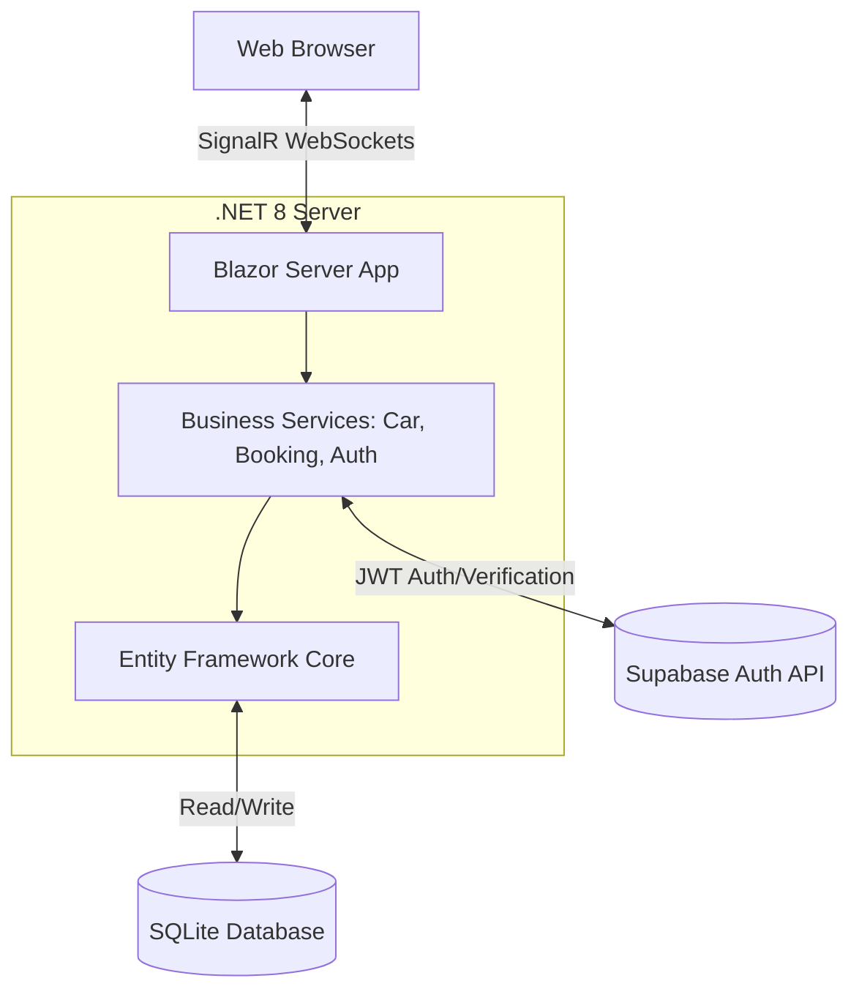

# Comprehensive Project Report
## Premium Vehicle Rental System (PDM Rentals)

---

## 1. Abstract
The **Premium Vehicle Rental System (PDM Rentals)** is a modern, responsive web application developed to digitalize the vehicle rental process. This platform connects customers seeking high-quality rental vehicles with administrators managing inventory and bookings. Built on the highly efficient **Blazor Server** framework using **.NET 8**, it ensures a seamless, real-time user experience. The application leverages **Entity Framework Core (EF Core)** with an **SQLite** database for robust data management, while integrating **Supabase** for secure, enterprise-grade authentication. This project successfully demonstrates modern full-stack development, N-tier architecture, and responsive UI/UX principles.

---

## 2. Introduction

### 2.1 Problem Statement
Traditional car rental agencies often rely on manual bookkeeping or fragmented legacy software, leading to lost reservations, double bookings, and a frustrating customer experience. Customers lack the ability to browse vehicle availability in real-time, and administrators struggle with inefficient inventory management.

### 2.2 Project Scope & Objectives
The core objective is to deliver a centralized, automated web solution that:
- **For Customers:** Provides an intuitive catalog to browse vehicles by categories (e.g., Luxury, Electric, SUVs), view real-time availability, and submit booking requests securely.
- **For Administrators:** Offers a dedicated, authenticated dashboard to manage user accounts, oversee the vehicle fleet, and approve/reject rental bookings.
- **Technical Objectives:** Implement a secure, scalable N-tier architecture utilizing Blazor Server, ensuring stateful, fast, and secure client-server interactions.

---

## 3. System Requirements Specification (SRS)

### 3.1 Functional Requirements
- **User Authentication:** Users must be able to register and log in securely.
- **Vehicle Catalog:** The system must display vehicles categorized by type, complete with pricing, specifications, and images.
- **Booking Management:** Authenticated users can submit a booking form capturing dates, driver details, and payment methods.
- **Admin Dashboard:** Administrators require CRUD (Create, Read, Update, Delete) access to the vehicle inventory and the ability to process (Approve/Reject) booking requests.

### 3.2 Non-Functional Requirements
- **Performance:** As a Blazor Server app, the UI must react instantly via SignalR WebSockets.
- **Security:** User passwords must never be stored locally; instead, an external identity provider (Supabase Auth) is used.
- **Responsiveness:** The UI must adapt to mobile, tablet, and desktop screens using responsive CSS/Bootstrap.
- **Reliability:** Data integrity must be enforced via server-side EF Core constraints and client-side DataAnnotations.

### 3.3 Hardware & Software Requirements
- **Framework:** .NET 8.0 SDK
- **Backend/Frontend:** Blazor Server (Interactive Server Components)
- **Database:** SQLite (`pdmrentals.db`)
- **ORM:** Entity Framework Core 8
- **External API:** Supabase (for Authentication)

---

## 4. System Design & Architecture

### 4.1 Architectural Pattern
The system follows a modernized **N-Tier Architecture** tailored for Blazor:
1. **Presentation Layer:** Blazor `.razor` components (`Home.razor`, `BookingForm.razor`).
2. **Business Logic Layer:** Scoped and Singleton services (`CarService`, `BookingService`, `AuthService`).
3. **Data Access Layer:** `AppDbContext` mapping C# objects to SQLite tables.

### 4.2 System Architecture Diagram

### 4.3 Use Case Breakdown
- **Customer Actions:** Register/Login, Browse Vehicles, Submit Booking Request.
- **Admin Actions:** Secure Login via `/admin`, Manage Vehicles Inventory (Add/Edit/Delete), Approve/Reject Bookings, Manage User Roles.

---

## 5. Database Design & Entity Relationship

The relational database is designed for normalized, efficient data retrieval.

### 5.1 Entity Relationship Diagram Concept
- **`USER` (1)** places **`BOOKING` (Many)**
- **`CAR` (1)** is reserved in **`BOOKING` (Many)**

### 5.2 Schema Breakdown
- **`User` Table:** Acts as a local profile mirror for the Supabase Auth system. The `Id` field matches the secure UUID generated by Supabase.
  - Fields: `Id` (PK), `FullName`, `Email`, `Role`, `CreatedAt`
- **`Car` Table:** Contains vehicle metadata, pricing (`DailyRate`), and technical specifications (`Fuel`, `Seats`, `Transmission`).
  - Fields: `Id` (PK), `Name`, `Category`, `Price`, `Status`, `Transmission`, `Fuel`, `Seats`, `Mileage`
- **`Booking` Table:** The junction/transaction table linking a `User` to a `Car`, capturing the temporal data (`Days`), financial data (`TotalAmount`), and administrative state (`Status`).
  - Fields: `Id` (PK), `UserId` (FK), `CarId` (FK), `Days`, `TotalAmount`, `Status`, `CreatedAt`

---

## 6. Implementation Details

### 6.1 State Management & Real-time UI
By leveraging **Blazor Server**, the application maintains the user's state on the server. UI updates, such as switching a booking from "Pending" to "Approved", are pushed instantly to the client over a SignalR connection, avoiding heavy JavaScript and API boilerplate.

### 6.2 Authentication Flow (Supabase)
Security is paramount. Instead of rolling a custom, potentially vulnerable hashing algorithm, the application offloads credential management to **Supabase**.
- **SignUp/SignIn:** The `AuthService` communicates with the Supabase REST API.
- **Local Mirroring:** Upon successful authentication, a profile record is created in the local SQLite `User` table to maintain relational integrity with `Booking` records.

### 6.3 Data Validation
Blazor's `EditForm` component is combined with C# `[DataAnnotations]`:
- `[Required]`, `[EmailAddress]`, and `[Range]` attributes are applied to the `Booking` and `Car` models.
- The UI features a `<ValidationSummary />` to instantly warn users of invalid input before hitting the database, reducing server load and preventing SQL exceptions.

---

## 7. Testing & Quality Assurance
To ensure a robust application, the following methodologies are applied:
1. **Unit Testing (Conceptual):** Logic within `CarService` and `BookingService` can be tested in isolation from the UI.
2. **Integration Testing:** Ensuring `AppDbContext` correctly writes and reads to the `pdmrentals.db` SQLite file.
3. **UI/UX Testing:** Verifying that Blazor components render correctly across different screen sizes and that form validations block erroneous submissions.

---

## 8. Conclusion
The **Premium Vehicle Rental System** successfully bridges the gap between car rental businesses and their customers. By utilizing a modern, cohesive Microsoft stack (.NET 8, Blazor, EF Core), the project achieved a clean, maintainable, and highly performant codebase. The integration of SQLite provides a frictionless deployment model, while Supabase ensures enterprise-level security. This project stands as a comprehensive demonstration of full-stack software engineering principles, from database normalization to real-time UI rendering.

---

## 9. Future Enhancements
Given more time, the system can be expanded to include:
- **Payment Gateway Integration:** Implementing Stripe or PayPal for direct online payments.
- **Email Notifications:** Sending automated booking confirmations to users via SMTP/SendGrid.
- **Live Tracking:** Integrating a map API to track rented vehicles via GPS simulation.
